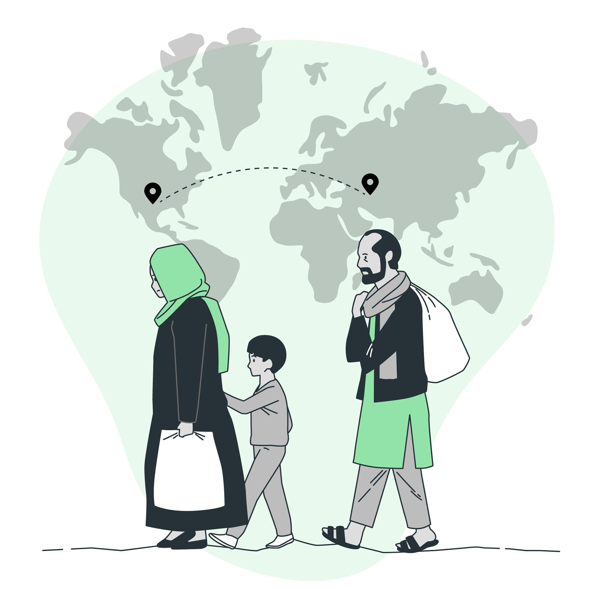

# Proyecto de Análisis de Incidentes Migratorios

## Descripción

Este proyecto tiene como objetivo brindar una visión detallada y comprensiva de los desafíos y dificultades que enfrentan las personas que emigran a otros países en busca de una nueva vida. A través del análisis de los principales incidentes migratorios, nos enfocamos en proporcionar una perspectiva completa de la cruda realidad que experimentan mujeres, niños y hombres en este proceso.

## Objetivos

1. Visibilizar las situaciones de riesgo y vulnerabilidad a las que se enfrentan los migrantes durante su travesía.
2. Analizar y comprender los principales incidentes que afectan a distintos grupos demográficos, incluyendo mujeres, niños y hombres.
3. Generar conciencia sobre la importancia de abordar de manera integral los retos humanitarios asociados con la migración.
4. Proporcionar información útil para la formulación de políticas y estrategias orientadas a proteger y apoyar a los migrantes en su viaje hacia una nueva vida.

## Datos
Los datos fueron tomados por la [OIM](https://www.iom.int/es)
Para mayor informacion entra en la [Web](https://www.iom.int/es)

